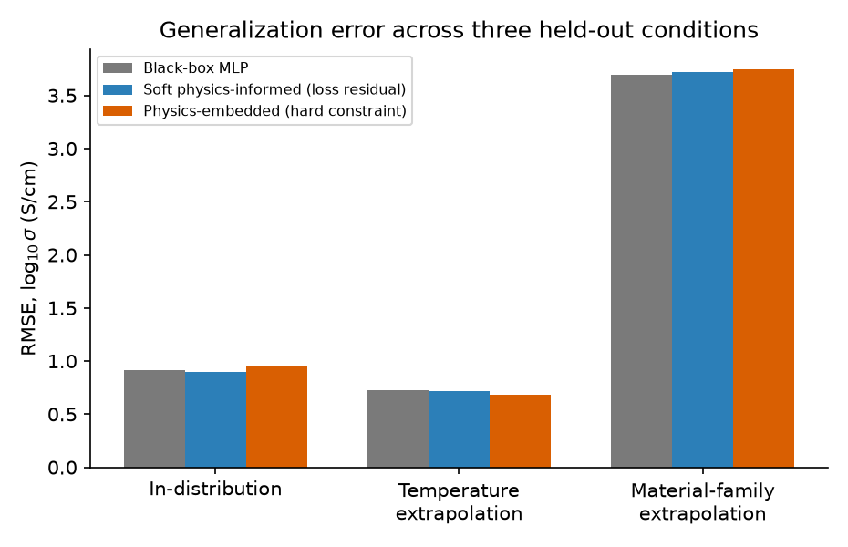
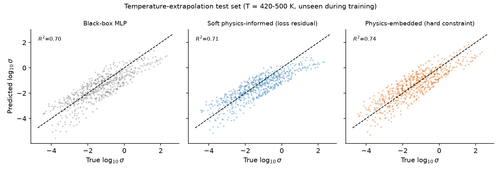
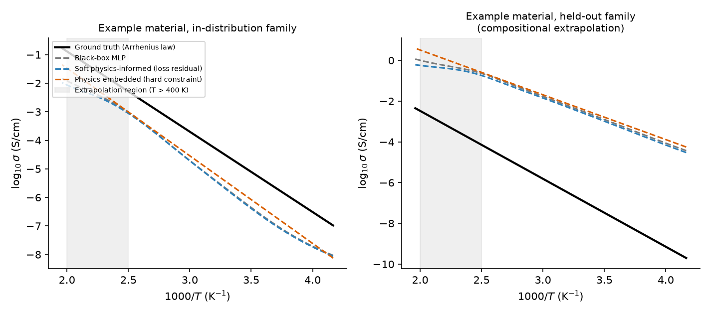
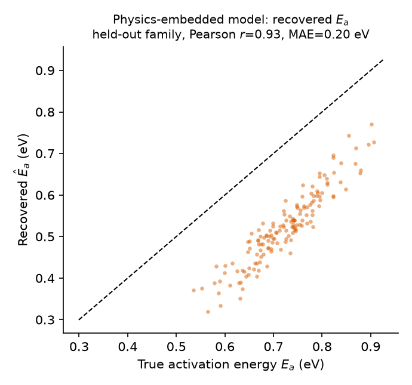
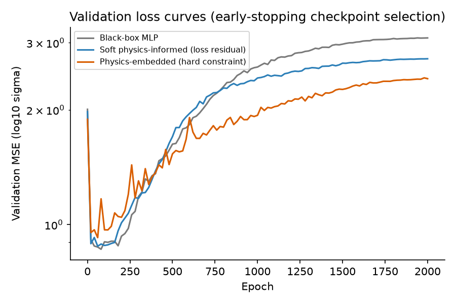

# Physics-Informed Deep Learning for Prediction of Electrical Conductivity in Solid-State Materials

**Mohammed Hamzah Khudhur**
*Department of Electrical Engineering, College of Engineering, University of Wasit, Kut, Iraq*
*Corresponding author: mohammed.hamzah@uowasit.edu.iq*

> Full typeset version: [`Physics-Informed Deep Learning for Prediction of Electrical Conductivity in Solid-State Materials.tex`](Physics-Informed Deep Learning for Prediction of Electrical Conductivity in Solid-State Materials.tex) / [`Physics-Informed Deep Learning for Prediction of Electrical Conductivity in Solid-State Materials.pdf`](Physics-Informed Deep Learning for Prediction of Electrical Conductivity in Solid-State Materials.pdf). This Markdown file mirrors the same content for readability on GitHub.

## Abstract

Data-driven models for the electrical (ionic) conductivity of solid-state materials are usually trained as black boxes that map composition or structure descriptors directly onto a measured or computed conductivity value. Such models can interpolate well within the range of temperatures and compositions they were trained on, but they have no obligation to obey the Arrhenius temperature dependence that governs thermally activated ion transport, and their predictions can degrade unpredictably outside the training envelope.

We compare three deep learning strategies for predicting the electrical conductivity of solid ionic conductors as a function of temperature and structural descriptors:

- **(A) Black-box** — a standard multilayer perceptron trained with a data-only loss.
- **(B) Soft physics-informed** — a network of identical architecture, trained with an additional collocation-based residual that penalizes violations of the Arrhenius differential relation.
- **(C) Physics-embedded** — a network that predicts the two Arrhenius parameters (activation energy and pre-exponential factor) from structural descriptors alone and computes conductivity analytically, so the correct exponential temperature dependence is guaranteed by construction rather than learned.

All three models are trained from scratch on a controlled, physically grounded synthetic benchmark constructed so that the descriptor-to-property mapping is nonlinear and family-dependent, while the temperature dependence at fixed composition follows the Arrhenius law with realistic observational noise.

On in-distribution test materials the three approaches are statistically comparable (R² = 0.80–0.82). When evaluated on unseen temperatures 20–100 K above the training range, the physics-embedded model reduces RMSE in log₁₀σ by **5.9%** relative to the black-box model (R² = 0.736 vs. 0.703), with the soft-constraint model falling in between — a monotonic benefit from increasing the strength of physics integration for temperature extrapolation specifically. On a fourth, structurally distinct material family withheld entirely from training, all three models fail comparably (R² ≈ −1.4 to −1.5), demonstrating that embedding a known physical law regularizes extrapolation only along the variable that law governs, and does not by itself confer robustness to covariate shift in the structural descriptor space. The physics-embedded model nonetheless recovers activation energies for the held-out family that correlate strongly with ground truth (Pearson r = 0.93) despite a systematic underestimation bias, illustrating a genuine interpretability benefit of a physically structured output even when the point predictions themselves are unreliable.

We release the full generative model, training code, and results for reproducibility.

**Keywords:** physics-informed neural networks, ionic conductivity, solid-state electrolytes, Arrhenius law, materials informatics, extrapolation

---

## 1. Introduction

Solid-state electrolytes are a central design bottleneck for next-generation batteries, and the property that ultimately decides whether a candidate material is useful is its ionic conductivity: too low, and the cell cannot deliver useful current density; competitive values in the best inorganic conductors reach 10⁻²–10⁻³ S/cm at room temperature (Famprikis et al., 2019). Conductivity is expensive to measure and expensive to compute from first principles, since it requires either synthesizing and characterizing a candidate or running long molecular dynamics trajectories to extract diffusion coefficients. Both bottlenecks, building on the broader rise of deep learning as a general-purpose function approximator (LeCun, Bengio & Hinton, 2015), have motivated a decade of work on machine-learned surrogates that predict conductivity, or its associated activation energy, directly from composition and structure (Sendek et al., 2017; Sendek et al., 2019; Butler et al., 2018; Xie & Grossman, 2018).

Most of these surrogates are trained as conventional supervised regressors: a feature vector goes in, a conductivity value comes out, and the model is free to represent any function that fits the training data. This flexibility is also the source of a specific failure mode. Ionic conductivity in a fixed material is not an arbitrary function of temperature; over the range where a single conduction mechanism dominates, it follows the Arrhenius relation

```
σ(T) = A · exp(−Ea / (kB·T))
```

where Ea is the migration activation energy, A is a pre-exponential factor set by attempt frequency and mobile-ion concentration, and kB is the Boltzmann constant. A black-box regressor trained only on data has no mechanism that forces it to respect this law, and nothing prevents it from producing a curve that looks reasonable inside the training temperature window but bends the wrong way, saturates, or otherwise disagrees with the known physics once evaluated outside it. Because most experimental conductivity datasets are measured over a narrow, instrument-limited temperature range, and because a core use case for these models is to predict behavior at operating temperatures that were never measured, this is not a hypothetical concern.

Physics-informed neural networks (PINNs) were introduced as a general strategy for encoding known governing equations into deep learning models, either as soft penalties added to the training loss or as constraints built into the network architecture (Raissi, Perdikaris & Karniadakis, 2019; Karniadakis et al., 2021; Faroughi et al., 2024). The approach has been applied extensively to forward and inverse problems in fluid mechanics and solid mechanics, but its use for structure-property prediction in materials science, and for ionic transport specifically, remains comparatively underexplored. This gap is what motivates the present study: does encoding the Arrhenius law into a conductivity-prediction network actually improve generalization, and if so, along which axis?

We address this question with a controlled experiment rather than a benchmark on an existing experimental database, for a specific reason. Existing conductivity datasets are small, are measured over inconsistent and often narrow temperature windows, and mix multiple chemical families with confounded descriptor distributions, which makes it difficult to attribute a change in test error to a specific generalization mechanism. Instead, we construct a synthetic benchmark in which the ground-truth structure-to-property mapping and the ground-truth temperature dependence are both known exactly, which lets us pose three cleanly separated generalization questions: how well does a model interpolate among materials it has not seen, how well does it extrapolate in temperature for materials from a family it has seen, and how well does it extrapolate to a material family it has never seen. Section 4 gives the full generative model and makes clear that all reported numbers come from this synthetic benchmark, not from an experimental database.

Our contributions are threefold. First, we implement, from first principles, three deep learning architectures spanning the spectrum from purely data-driven to fully physics-embedded for conductivity prediction, and we describe the exact gradient computations required to train a physics-embedded decoder and a collocation-based physics residual without an automatic-differentiation framework. Second, we quantify, on a benchmark designed for the purpose, that physics-informed constraints yield a real but specific benefit: a consistent, monotonic reduction in temperature-extrapolation error as more physics is embedded, with no corresponding benefit — and in this case a small additional cost — on compositional (family) extrapolation. Third, we show that the physics-embedded model's internal activation-energy predictions remain informative (strongly rank-correlated with ground truth) even in the compositional-extrapolation regime where its point predictions of conductivity are unreliable, which is a form of interpretability a black-box model cannot offer even in principle.

## 2. Related Work

**Machine learning for ionic conductivity and solid electrolytes.** Sendek et al. (2017) combined density-functional-theory-derived structural descriptors with a logistic-regression classifier to screen more than 12,000 candidate lithium-containing solids for fast-ion-conduction behavior, roughly a million times faster than direct ab initio estimation of migration barriers, and later extended the approach with a broader machine-learning search that identified new candidate conductors for experimental follow-up (Sendek et al., 2019). Crystal graph convolutional neural networks (Xie & Grossman, 2018) and related graph-based architectures learn material representations directly from atomic connectivity and have become a standard tool for property prediction across many material classes, including transport-related properties. Butler et al. (2018) survey the broader use of machine learning across molecular and materials science, including its use for accelerating candidate screening in energy materials.

This screening program remains active and has continued to scale up. Pereznieto et al. (2023) trained a random-forest model on experimentally reported Na-ion conductivities and applied it to roughly 25,000 compounds drawn from open materials databases, flagging four candidates (NaPb₃, Na₃BiO₃, Na₂MoO₄, NaMoF₆) whose predicted high conductivity was subsequently supported by density-functional-theory calculations. Kang, Kim & Min (2023) built a two-stage pipeline that screens 19,480 Li-containing compounds with a gradient-boosted surrogate model, trained on a 145-feature chemical descriptor together with crystal-system and atom-count information, and then validates the top-ranked candidates with ab initio molecular dynamics; electronegativity and melting point emerged as the most predictive individual features, and two of the surrogate-selected compounds, Li4.5TiO3.25 and Li2VCl5, were confirmed as superionic by the follow-up simulations. Park, Chung, Min et al. (2024) take an entirely unsupervised route: they cluster 180-dimensional structural feature vectors for 12,670 Na-containing compounds with density-based clustering (HDBSCAN) and recover twelve structural groups, several of which correspond to already-known superionic families such as NASICONs and sodium chalcogenides, without ever using a labeled conductivity value as a training target. Moving from structure-property regression to bottom-up simulation, Maevskiy et al. (2025) propose replacing the expensive first-principles molecular dynamics or nudged-elastic-band step of a conductivity pipeline with a universal, equivariant graph-neural-network interatomic potential trained on large first-principles datasets, and explicitly flag that the inference-time generalization error of such potentials on structurally diverse or out-of-training-distribution atomic environments can itself compromise the reliability of the resulting conductivity estimate — the same generalization concern our study investigates, arising instead at the level of the interatomic potential rather than the structure-property surrogate. None of this line of work, including its most recent instances, builds the Arrhenius temperature dependence into the model architecture; conductivity or activation energy is treated as a static, temperature-independent target, sidestepping the extrapolation question we study here.

**Physics-informed machine learning.** Raissi et al. (2019) introduced physics-informed neural networks as a way to train networks that satisfy a governing differential equation at a set of collocation points in addition to fitting available data, and Karniadakis et al. (2021) review the resulting family of methods and their extension to physics-guided, physics-informed, and physics-encoded variants across scientific computing. Faroughi et al. (2024) provide a taxonomy that distinguishes networks that merely use physics-derived features (physics-guided), networks that add a physics-based loss term (physics-informed), and networks whose architecture makes certain physical relationships structurally impossible to violate (physics-encoded).

More recent surveys extend this taxonomy in two directions relevant to our design choices. Malashin et al. (2025) specialize it to polymer science, where multi-scale behavior linking atomistic and macroscopic descriptions makes the choice between a soft loss penalty and a hard architectural constraint a recurring, domain-specific design decision for property prediction, structural design, and process optimization. Watson et al. (2024) generalize it in the other direction, organizing the field into physics knowledge imposed at the architectural level — through objective functions, structured predictive models, or data augmentation — versus physics knowledge treated as data itself, accessed through multi-task, meta-, or contextual learning rather than built into the model directly. Our model B (a physics-based objective-function penalty) and model C (a structured predictive model whose output layer is the governing equation) are specific instances of the first two items in the Watson et al. architectural category, evaluated here head-to-head against the same black-box baseline and against each other, which their survey does not do for any single prediction task. The present paper's three models (A, B, C) map onto exactly the Faroughi et al. taxonomy: a plain data-driven baseline, a physics-informed model in the classical soft-penalty sense, and a physics-encoded model in which the governing equation is the decoder itself.

**Out-of-distribution generalization in materials informatics.** A separate, largely independent line of work has recently begun to interrogate how well materials-property models generalize outside their training distribution at all, independent of whether any physics is embedded. Across a systematic audit of more than 700 nominally out-of-distribution tasks spanning multiple materials datasets and model families (including both graph neural networks and gradient-boosted trees), Li et al. (2025) find that heuristic definitions of "out-of-distribution" mostly still test interpolation rather than genuine extrapolation, because most test points fall inside regions of the learned representation space that training data already covers densely; this leads published claims about neural-network scaling benefits to be substantially overstated on the minority of tasks that are genuinely extrapolative, where more data or more training time helps little or not at all. Segal et al. (2025) target the genuinely extrapolative regime directly with a transductive approach: rather than fitting a fixed function from inputs to properties, their method exploits analogical input-target relations between the (labeled) training set and the (unlabeled, extrapolative) test set to extrapolate zero-shot beyond the property range seen during training, improving extrapolative precision by a factor of 1.8 on materials tasks and 1.5 on molecular tasks, and increasing recall of genuinely high-performing candidates by up to a factor of 3 relative to standard regression baselines. We revisit both papers in the Discussion, where our family-extrapolation condition turns out to be a small, controlled instance of exactly the failure mode they document at much larger scale, and where the contrast between their transductive, target-driven remedy and our architecture-driven one clarifies what embedding a physical law can and cannot fix.

**The Nernst-Einstein relation and the limits of simple transport models.** The Arrhenius form we embed is itself an approximation. Marcolongo & Marzari (2017) show, using first-principles molecular dynamics, that the closely related Nernst-Einstein relation between the ionic conductivity and the self-diffusion coefficient breaks down in solid electrolytes with strongly correlated ion motion, requiring a Haven-ratio correction. We return to this point in the Discussion: the "physics" encoded in our model C is a widely used and pedagogically standard relation, not a first-principles law without exception, and a physics-embedded model is only as reliable as the physics it embeds.

## 3. Physical Background

Ionic conduction in a solid electrolyte with a single dominant hopping mechanism is thermally activated: mobile ions must surmount a migration barrier Ea set by the local coordination environment and the geometry of the conduction pathway. Over a temperature range where the mechanism, defect concentration, and correlation effects do not themselves change with temperature, this thermal activation gives rise to the Arrhenius law, equivalently written as a straight line in an Arrhenius plot,

```
log10 σ(T) = log10 A − [Ea / (kB · ln10)] · (1/T)
```

with slope −Ea/(kB·ln10) against 1/T. This linearity is the single most diagnostic signature used by experimentalists to confirm that a measured conductivity series reflects one activated process, and it is exactly the relation a physics-informed model can exploit: any two points on a measured or predicted Arrhenius line determine Ea and A, and any additional points should fall on the same line if the mechanism does not change.

Two caveats limit how far this idealization should be trusted, and both matter for interpreting our results honestly. First, Ea and log A are themselves complicated, nonlinear functions of composition and structure: bottleneck size, lattice free volume, carrier concentration, bond covalency, and ionic radius mismatch all contribute, often with interaction effects, and different structural families (garnets, NASICON-type phosphates, sulfides, perovskites) occupy different, only partially overlapping regions of this parameter space (Famprikis et al., 2019). This is precisely the mapping our deep networks are asked to learn; embedding the Arrhenius relation does nothing to make this mapping easier to learn — it only guarantees that whatever Ea and log A the network does learn get used consistently across temperature. Second, the Arrhenius relation is a mean-field, uncorrelated-hopping approximation. The related Nernst-Einstein relation, which connects conductivity to a self-diffusion coefficient, is known to fail by a substantial margin in solid electrolytes with correlated ion motion (Marcolongo & Marzari, 2017); some real conductors also show curved (non-Arrhenius) behavior from a temperature-dependent mechanism crossover. Our synthetic benchmark generates data under the assumption that the Arrhenius relation holds exactly for a single family at fixed composition (plus observational noise), which is a controlled idealization chosen to isolate the extrapolation question, not a claim that every real solid electrolyte obeys it exactly.

## 4. Methods

### 4.1 A physically grounded synthetic benchmark

We generate a synthetic dataset in which the temperature dependence at fixed composition follows the Arrhenius relation exactly (before noise), while the mapping from five structural descriptors to the two Arrhenius parameters (Ea, log₁₀A) is nonlinear and specific to one of four material families loosely labeled sulfide-like, garnet-like, NASICON-like, and perovskite-like, with baseline activation energies of 0.25, 0.35, 0.30, and 0.50 eV respectively and baseline log₁₀A (in S·K/cm) of 4.5, 4.0, 4.2, and 3.7. These baselines and the descriptor effect sizes below are illustrative, chosen to be internally consistent and to fall within the broad range reported for real inorganic ion conductors (Famprikis et al., 2019), not fitted to any specific experimental compound.

For each material, five descriptors x1,…,x5 ∈ [0,1] are drawn independently from a uniform distribution, representing (in order) a bottleneck migration-channel radius ratio, a lattice free-volume fraction, a normalized carrier concentration, a lattice rigidity/bond-covalency index, and an ionic radius mismatch. The activation energy and pre-exponential factor are computed as

```
Ea      = Ea_fam    + 0.15(1−x1) + 0.10(1−x2) + 0.12·x4 + 0.10·x5 − 0.05·x3 + 0.10·x1·x4 + noise
log10 A = logA_fam  + 0.8·x2 + 0.6·x3 − 0.4·x5 − 0.3·x4 − 0.25·x2·x5 + noise
```

with Gaussian structure-property noise (σ = 0.015 eV on Ea, σ = 0.08 on log₁₀A), and both quantities clipped to physically admissible ranges (Ea ∈ [0.05, 1.2] eV, log₁₀A ∈ [1.0, 7.0]). Given (Ea, log₁₀A) for a material, we sample conductivity at a set of temperatures via the Arrhenius relation with additional Gaussian observation noise (σ = 0.03 in log₁₀σ), emulating measurement scatter.

We use this generative model to build five disjoint material pools, each expanded over a set of temperatures into (temperature, descriptors, log₁₀σ) rows:

| Split | Materials | Families | Temperatures |
|---|---|---|---|
| Optimization | 480 | sulfide/garnet/NASICON | 250, 280, 310, 340, 370, 400 K |
| Validation (early stopping) | 120 | sulfide/garnet/NASICON | same as above |
| In-distribution test | 150 | sulfide/garnet/NASICON | same as above |
| Temperature-extrapolation test | 150 | sulfide/garnet/NASICON | 420, 450, 480, 500 K (unseen) |
| Family-extrapolation test | 150 | perovskite-like (unseen) | same as training |

All splits are generated with a fixed random seed (42) for reproducibility, and the code that generates them is released alongside this paper.

### 4.2 Three model architectures

All three models share the same hidden-layer sizes (two layers of 32 units, tanh activation) and are trained from scratch with a hand-written NumPy implementation of forward and backward propagation and the Adam optimizer with decoupled weight decay (batch size 64, cosine learning-rate schedule from 3×10⁻³ to 5×10⁻⁵ over 2000 epochs, weight decay 2×10⁻⁴), so that any difference in test performance can be attributed to the physics-integration strategy rather than to differences in capacity, optimizer, or training budget. Model checkpoints are selected by early stopping on the validation split, evaluated every 20 epochs.

- **Model A (black-box).** A standard feed-forward network takes temperature (standardized) concatenated with the five structural descriptors as input and outputs log₁₀σ directly. It is trained with mean-squared-error loss against the noisy observed conductivity and has no access to the Arrhenius relation in any form.

- **Model B (soft physics-informed).** Identical architecture and inputs to model A, trained with a combined loss L = L_data + λ·L_phys (λ = 0.5). The physics term is evaluated at collocation points: for a batch of descriptor vectors and randomly sampled temperatures Tc ∈ [230, 420] K, we query the network at Tc and Tc + δT (δT = 6 K) and form the finite-difference estimate of the implied local activation energy, penalizing it if it falls outside the physically admissible window [0.05, 1.2] eV or takes the wrong sign (conductivity increasing with 1/T, which would violate thermal activation). This is a physics residual in the classical PINN sense: it does not tell the network what Ea should be for a given material, only that whatever local slope it produces in the Arrhenius plot must be physically plausible and of the correct sign everywhere, not only at the observed training temperatures.

- **Model C (physics-embedded).** This network takes only the five structural descriptors as input (no temperature) and outputs two numbers, Êa and log₁₀Â. Conductivity is then computed analytically via the Arrhenius relation, using the queried temperature, and the whole pipeline is trained end-to-end by backpropagating the data-loss gradient through this closed-form decoder into the two output heads and from there through the shared hidden layers. Unlike model B, model C cannot produce a curve that violates the Arrhenius relation at any temperature, by construction; the only quantities it is free to get wrong are Ea and log A themselves.

### 4.3 Evaluation protocol

We report RMSE, MAE, and R² on log₁₀σ for each of the three held-out conditions described above. For model C we additionally report the Pearson correlation and MAE between its recovered Êa and the ground-truth Ea on the held-out family, as a direct probe of whether its internal, physically meaningful state remains informative when its output predictions are not.

## 5. Results

### 5.1 In-distribution performance

On materials from the three training families, evaluated at training temperatures, all three models perform comparably: R² = 0.816 (black-box), 0.822 (soft physics-informed), and 0.802 (physics-embedded), with RMSE of 0.91, 0.90, and 0.95 in log₁₀σ respectively (Figure 1, Table 1). The differences among the three are within the run-to-run variation we observe from floating-point nondeterminism in the underlying matrix operations, and none should be read as a meaningful ranking: when the temperature range and material family match the training distribution, embedding physics neither helps nor hurts appreciably, because a sufficiently flexible black-box network can already represent the (mildly nonlinear) Arrhenius curve over a bounded temperature window.

### 5.2 Temperature extrapolation

The picture changes when the same three families of materials are evaluated at temperatures 20–100 K above anything seen during training. RMSE increases for all models relative to the in-distribution case (expected, given that the target's dynamic range grows with 1/T), but the increase is smallest for the physics-embedded model and largest for the black-box model: RMSE of 0.727 (R² = 0.703) for model A, 0.713 (R² = 0.714) for model B, and 0.684 (R² = 0.736) for model C — a **5.9% RMSE reduction** for the physics-embedded model relative to the black-box baseline. The ordering A > B > C is monotonic in the strength of physics integration and holds across all three error metrics we compute (Table 1), which is the central quantitative result of this paper: encoding the correct functional form of the temperature dependence measurably improves extrapolation specifically along the temperature axis, with a soft, loss-based encoding capturing part of the benefit of a hard, architecture-based encoding.

Figure 2 shows this directly as parity plots on the temperature-extrapolation test set: all three models show the same qualitative pattern of increasing scatter at low true conductivity (equivalently, at the highest extrapolated temperatures, where a small error in the learned Ea-like slope compounds over a larger 1/T range), but the spread is visibly tighter for model C. Figure 3 illustrates the mechanism with a single representative material: within the training range (shaded boundary at T = 400 K) all three models track the true Arrhenius line closely, but beyond it the black-box and soft-informed curves drift further from the true line than the physics-embedded curve, which cannot depart from a straight line in the Arrhenius plot by construction.

### 5.3 Material-family (compositional) extrapolation

On the held-out, structurally distinct family that contributed zero materials to training, all three models fail, and fail comparably: R² = −1.419 (model A), −1.443 (model B), and −1.483 (model C), with RMSE around 3.7–3.75 in log₁₀σ, an order of magnitude worse than either of the previous two conditions (Table 1, Figure 1). Negative R² means all three models perform worse than simply predicting the mean conductivity of the held-out family; none of them, including the physics-embedded model, has learned a descriptor-to-property mapping that transfers to this unseen region of structural space. If anything, the physics-embedded model is very slightly worse than the black-box model here (RMSE 3.748 vs. 3.699), the opposite ranking from the temperature-extrapolation case.

This result is not a failure of the experiment; it is the experiment doing its job. The held-out family's baseline activation energy (0.50 eV) sits well outside the range spanned by the three training families (0.25–0.35 eV baseline, extended by descriptor effects to roughly 0.2–0.85 eV in total), so predicting it correctly from structural descriptors alone requires genuine extrapolation of the encoder network x → (Ea, log A), a completely different generalization problem from extrapolating a known functional form in a single scalar variable. Embedding the Arrhenius law constrains how the model is allowed to behave once (Ea, log A) are known; it places no constraint whatsoever on how those two numbers themselves should extrapolate as a function of structural descriptors the model has never encountered in this combination.

### 5.4 Physical interpretability under compositional shift

Even though model C's point predictions of conductivity are unreliable for the held-out family, its internal, physically meaningful output is not useless. The recovered activation energies Êa for the 150 held-out-family materials correlate strongly with the true Ea values (Pearson r = 0.93, MAE = 0.20 eV; Figure 4), even though they carry a clear systematic bias, underestimating Ea across essentially the whole range (recovered values cluster around 0.4–0.75 eV against true values of 0.5–0.9 eV). A domain expert inspecting this model's output would see a physically interpretable quantity, with a diagnosable bias, in a setting where a black-box model offers only a number with no comparable diagnostic. This is a structural property of model C's architecture, not an accident of this particular training run: because Ea and log A are actual, separately supervised (through the decoder) intermediate quantities rather than an emergent internal representation, they remain visible and checkable against known physical bounds even when the model is operating outside its reliable regime.

**Table 1.** Test-set metrics (log₁₀σ, in S/cm) for the three models across the three generalization conditions. Best value per row in **bold**.

| Condition | Metric | A: Black-box | B: Soft PINN | C: Physics-embedded |
|---|---|---|---|---|
| In-distribution (n=900) | RMSE ↓ | 0.912 | **0.896** | 0.945 |
| | MAE ↓ | 0.766 | **0.751** | 0.798 |
| | R² ↑ | 0.816 | **0.822** | 0.802 |
| Temperature extrapolation (n=600) | RMSE ↓ | 0.727 | 0.713 | **0.684** |
| | MAE ↓ | 0.593 | 0.587 | **0.572** |
| | R² ↑ | 0.703 | 0.714 | **0.736** |
| Family extrapolation (n=900) | RMSE ↓ | **3.699** | 3.718 | 3.748 |
| | MAE ↓ | **3.648** | 3.668 | 3.684 |
| | R² ↑ | **-1.419** | -1.443 | -1.483 |



**Figure 1.** RMSE by condition.



**Figure 2.** Parity plots, temperature extrapolation.



**Figure 3.** Arrhenius plots, example materials.



**Figure 4.** Recovered vs. true activation energy.



**Figure 5.** Validation loss curves.

## 6. Discussion

The result we consider most useful to a practitioner is the clean separation between two kinds of generalization that are often conflated under the single label "extrapolation." Embedding a governing equation regularizes a model's behavior along the variable that equation is written in terms of; here, that is temperature, and the benefit shows up exactly where a domain scientist would predict it should: at temperatures outside the training window, for materials whose structural family the model has already learned. It does not, and structurally cannot, regularize the model's behavior with respect to variables the governing equation treats as free parameters — here, the structural descriptors that determine Ea and log A in the first place. A network that has learned to obey the Arrhenius law perfectly can still learn an arbitrarily wrong descriptor-to-Ea mapping, and will then obey the Arrhenius law perfectly around the wrong answer. This is visible directly in Figure 3: the physics-embedded model's curve for the held-out-family material is a straight line in the Arrhenius plot, exactly as it must be, but it is the wrong straight line, offset from the truth by a roughly constant amount that reflects the encoder's extrapolation error in Ea rather than any violation of thermal activation.

This pattern is consistent with, and helps explain, a broader observation now documented across the materials-informatics literature at much larger scale than our controlled experiment. Li et al. (2025) audited more than 700 nominally out-of-distribution materials-property tasks and found that the great majority are not, on inspection of the underlying representation space, meaningfully out-of-distribution at all: most test points sit inside regions the training data already covers, and it is only a minority of genuinely novel-chemistry or novel-symmetry tasks that see performance collapse, essentially independent of model family or training budget. Our family-extrapolation condition was deliberately constructed to fall in that minority category, by construction rather than by accident of a heuristic split: the held-out family's activation-energy range does not overlap the training families' range, so there is no way for any of our three models to have seen anything resembling it. That all three collapse together is exactly what Li et al. would predict for a task engineered to be genuinely, not just nominally, out-of-distribution.

Segal et al. (2025) respond to this same gap with a transductive remedy that targets the distribution shift directly, exploiting analogical relationships between labeled training examples and unlabeled extrapolative test examples to extrapolate zero-shot beyond the training property range, and reporting 1.8× better extrapolative precision on materials tasks as a result. Our own architecture-driven remedy, embedding a correct physical law along the temperature axis, is a different kind of intervention operating on a different axis of the input space, and the fact that it does nothing to rescue performance along the orthogonal, purely statistical axis of structural descriptors is consistent with the view these two papers jointly support: out-of-distribution generalization in materials property prediction needs interventions that target the specific axis of the distribution shift; neither a physics-agnostic architecture change nor a physics-embedded one is a substitute for that, and a transductive, data-driven fix of the kind Segal et al. propose may be a necessary complement to physics embedding rather than an alternative to it for a task like our family-extrapolation condition.

This also explains why model C is marginally, not dramatically, worse than models A and B under family extrapolation rather than simply equal to them. A black-box model has more degrees of freedom to (accidentally) partially compensate for a systematic bias in one direction using a compensating bias in another, because temperature and descriptors are mixed together in a single learned function; the physics-embedded model has no such freedom — its final output is a strict analytic function of exactly the two numbers its encoder produces, so any encoder bias propagates undiluted into the conductivity prediction. In this sense, hard-coding correct physics into part of a pipeline can very slightly amplify the visible cost of an error elsewhere in the pipeline that a more flexible model might otherwise partially and coincidentally cancel out. We do not think this is an argument against physics-embedding; a bias that is diagnosable, as Figure 4 shows it is here, is more useful to a materials scientist than a coincidentally smaller error that cannot be traced to any physical quantity. But it is a genuine cost, and a reason not to expect physics-informed architectures to be a uniform improvement over black-box baselines across every axis of generalization simultaneously.

The soft physics-informed model (B) sits between the other two on temperature extrapolation, as expected: a collocation-based residual nudges the learned function toward Arrhenius behavior everywhere it is evaluated, including outside the training temperature range, but it is a soft penalty competing against a data loss, not a structural guarantee, so it recovers only part of the benefit of the hard-constrained model C. This is a useful practical finding on its own: when a hard physics-embedded architecture is inconvenient to build — for example, because the governing relation is not as cleanly invertible as the two-parameter Arrhenius law — a soft collocation residual of the kind used here is comparatively simple to add to an existing black-box model and recovers roughly a third of the extrapolation benefit in our experiment (RMSE reduction of 1.9% for model B vs. 5.9% for model C, relative to model A).

Finally, we emphasize a point raised in Section 3: the physics we embedded, the simple Arrhenius relation, is itself an approximation that is known to break down under correlated ion transport (Marcolongo & Marzari, 2017). A physics-embedded model is only as trustworthy as the physics it is built around; embedding the wrong or incomplete governing relation would not merely fail to help — it could actively mislead a model into confidently wrong extrapolations dressed up with the appearance of physical rigor. Any application of this approach to real solid-electrolyte data should treat the choice of embedded relation — simple Arrhenius, Vogel-Tammann-Fulcher-type curvature, or a Nernst-Einstein-with-Haven-ratio correction — as a modeling decision to be justified by the conduction mechanism of the material class in question, not as a free, assumption-free source of extra accuracy.

## 7. Limitations

This study has several limitations that should temper how its conclusions are read. First and most importantly, all reported results come from a synthetic, physically grounded benchmark rather than from experimental conductivity measurements; the generative model in Section 4 was designed to expose a specific, cleanly separable pair of generalization questions, and while its parameter ranges and functional structure were chosen to be broadly consistent with published values for real inorganic ion conductors (Famprikis et al., 2019), it is not a substitute for validation against a real experimental or first-principles database, which we identify as the most important direction for follow-up work. Second, the descriptor set (five abstract, normalized structural features) is a simplification of the high-dimensional, often discrete representations (crystal graphs, site occupancies, coordination environments) used in state-of-the-art materials informatics pipelines (Xie & Grossman, 2018); our architectures and training procedure would need to be adapted, most likely by replacing the descriptor-encoding sub-network with a graph neural network, to operate on realistic crystal-structure inputs. Third, we embedded the simplest single-mechanism Arrhenius law and did not test the soft physics-informed model against a fundamentally different generalization axis than temperature (for example, pressure or dopant-concentration extrapolation, where an analogous physical relation could in principle be embedded). Fourth, our networks were trained from scratch with a compact, hand-written implementation for full transparency and reproducibility of the physics-embedded and soft-residual gradient computations; this was a deliberate choice for this methods-focused study, but it limits the model capacity and training scale we explored relative to what a production pipeline built on a standard automatic-differentiation framework would use. Finally, single-seed floating-point nondeterminism in the underlying numerical linear algebra means that the specific in-distribution ranking among the three models (where differences are small) should not be over-interpreted; the temperature-extrapolation and family-extrapolation rankings, where differences are larger and consistent with the physical mechanism argued in the Discussion, are the results we consider robust.

## 8. Conclusion

We built and compared three deep learning strategies, spanning purely data-driven to fully physics-embedded, for predicting the temperature-dependent electrical conductivity of solid-state ionic conductors, using a synthetic benchmark constructed so that the underlying physics and the underlying structure-property mapping are both known exactly. Embedding the Arrhenius law, either as a soft collocation-based training penalty or as a hard, architecturally guaranteed decoder, produces a consistent and monotonic reduction in error when models are asked to extrapolate to temperatures outside their training range, with the hard-constrained architecture giving roughly three times the benefit of the soft penalty in our experiment. The same physics integration confers no advantage — and a small disadvantage — when models are instead asked to extrapolate to a structurally novel material family, because the governing equation we embedded constrains temperature dependence, not the structure-to-property mapping that a physics-embedded model still has to learn from data alone. The physics-embedded model's internal activation-energy estimates remain strongly correlated with ground truth even in this failure regime, offering a form of diagnostic interpretability unavailable to a black-box model. We take the overall message to be that physics-informed deep learning is not a uniform cure for poor generalization in materials property prediction; it is a targeted tool that helps precisely along the axis its embedded equation governs, and practitioners building conductivity-prediction pipelines should choose which physics to embed, if any, based on which kind of extrapolation their downstream application actually requires.

## Data and Code Availability

All data used in this study are synthetically generated by a fully specified, seeded generative model (Section 4); no experimental or proprietary data were used. The complete generative model, the three model implementations (hand-written NumPy forward/backward propagation and Adam optimizer), the training and evaluation scripts, the resulting metrics (`results/results.json`), and the figure-generation code are released in this repository (`code/experiment.py`, `code/figures.py`). Results are reproducible from a fixed random seed (42); minor run-to-run numerical variation on the order of 1–2% can occur due to floating-point non-associativity in underlying linear-algebra routines and does not affect the qualitative conclusions reported here.

## Author Contributions (CRediT)

Mohammed Hamzah Khudhur: Conceptualization, Methodology, Software, Formal analysis, Investigation, Data curation, Writing – original draft, Writing – review & editing, Visualization.

## Funding

This work received no external funding.

## Conflict of Interest

The author declares no conflict of interest.

## Ethics Declaration

This study used only synthetically generated data and involved no human subjects, animal subjects, or personally identifiable information. No ethics approval was required.

## References

1. Raissi, M., Perdikaris, P., & Karniadakis, G. E. (2019). Physics-informed neural networks: A deep learning framework for solving forward and inverse problems involving nonlinear partial differential equations. *Journal of Computational Physics*, 378, 686–707. https://doi.org/10.1016/j.jcp.2018.10.045
2. Karniadakis, G. E., Kevrekidis, I. G., Lu, L., Perdikaris, P., Wang, S., & Yang, L. (2021). Physics-informed machine learning. *Nature Reviews Physics*, 3(6), 422–440. https://doi.org/10.1038/s42254-021-00314-5
3. Faroughi, S. A., Pawar, N. M., Fernandes, C., Raissi, M., Das, S., Kalantari, N. K., & Mahjour, S. K. (2024). Physics-Guided, Physics-Informed, and Physics-Encoded Neural Networks in Scientific Computing. *arXiv:2211.07377*.
4. Sendek, A. D., Yang, Q., Cubuk, E. D., Duerloo, K.-A. N., Cui, Y., & Reed, E. J. (2017). Holistic computational structure screening of more than 12,000 candidates for solid lithium-ion conductor materials. *Energy & Environmental Science*, 10(1), 306–320. https://doi.org/10.1039/C6EE02697D
5. Sendek, A. D., Cubuk, E. D., Antoniuk, E. R., Cheon, G., Cui, Y., & Reed, E. J. (2019). Machine Learning-Assisted Discovery of Solid Li-Ion Conducting Materials. *Chemistry of Materials*, 31(2), 342–352. https://doi.org/10.1021/acs.chemmater.8b03272
6. Famprikis, T., Canepa, P., Dawson, J. A., Islam, M. S., & Masquelier, C. (2019). Fundamentals of inorganic solid-state electrolytes for batteries. *Nature Materials*, 18(12), 1278–1291. https://doi.org/10.1038/s41563-019-0431-3
7. Xie, T., & Grossman, J. C. (2018). Crystal Graph Convolutional Neural Networks for an Accurate and Interpretable Prediction of Material Properties. *Physical Review Letters*, 120(14), 145301. https://doi.org/10.1103/PhysRevLett.120.145301
8. Butler, K. T., Davies, D. W., Cartwright, H., Isayev, O., & Walsh, A. (2018). Machine learning for molecular and materials science. *Nature*, 559(7715), 547–555. https://doi.org/10.1038/s41586-018-0337-2
9. LeCun, Y., Bengio, Y., & Hinton, G. (2015). Deep learning. *Nature*, 521(7553), 436–444. https://doi.org/10.1038/nature14539
10. Pereznieto, S., Jaafreh, R., Kim, J., & Hamad, K. (2023). Discovery of solid-state electrolytes for Na-ion batteries using machine learning. *Materials Letters*, 349, 134848. https://doi.org/10.1016/j.matlet.2023.134848
11. Kang, S., Kim, M., & Min, K. (2023). Discovery of Superionic Solid-State Electrolyte for Li-Ion Batteries via Machine Learning. *The Journal of Physical Chemistry C*, 127(39), 19335–19343. https://doi.org/10.1021/acs.jpcc.3c02908
12. Park, D., Chung, W., Min, B. K., et al. (2024). Computational screening of sodium solid electrolytes through unsupervised learning. *npj Computational Materials*, 10, 226. https://doi.org/10.1038/s41524-024-01392-6
13. Maevskiy, A., Carvalho, A., Sataev, E., Turchyna, V., Noori, K., Rodin, A., Castro Neto, A. H., & Ustyuzhanin, A. (2025). Predicting ionic conductivity in solids from the machine-learned potential energy landscape. *Physical Review Research*, 7, 023167. https://doi.org/10.1103/PhysRevResearch.7.023167
14. Malashin, I., Tynchenko, V., Gantimurov, A., Nelyub, V., & Borodulin, A. (2025). Physics-Informed Neural Networks in Polymers: A Review. *Polymers*, 17(8), 1108. https://doi.org/10.3390/polym17081108
15. Watson, J., Song, C., Weeger, O., Gruner, T., Le, A. T., Pompetzki, K., Hendawy, A., Arenz, O., Trojak, W., Cranmer, M., D'Eramo, C., Bülow, F., Goyal, T., Peters, J., & Hoffman, M. W. (2024). Machine Learning with Physics Knowledge for Prediction: A Survey. *Transactions on Machine Learning Research*. arXiv:2408.09840
16. Li, K., Rubungo, A. N., Lei, X., Persaud, D., Choudhary, K., DeCost, B., Dieng, A. B., & Hattrick-Simpers, J. (2025). Probing out-of-distribution generalization in machine learning for materials. *Communications Materials*, 6, 9. https://doi.org/10.1038/s43246-024-00731-w
17. Segal, N., Netanyahu, A., Greenman, K. P., Agrawal, P., & Gómez-Bombarelli, R. (2025). Known Unknowns: Out-of-Distribution Property Prediction in Materials and Molecules. *npj Computational Materials*, 11, 345. https://doi.org/10.1038/s41524-025-01808-x
18. Marcolongo, A., & Marzari, N. (2017). Ionic correlations and failure of Nernst-Einstein relation in solid-state electrolytes. *Physical Review Materials*, 1, 025402. https://doi.org/10.1103/PhysRevMaterials.1.025402

## Annotated Bibliography

The numbering below matches the reference list above. Each entry gives what the source is and, where relevant, how it bears specifically on this paper's design or argument, beyond the point where it is cited in the main text.

1. **Raissi, Perdikaris & Karniadakis (2019)** — The founding physics-informed neural network (PINN) paper: a governing differential equation is enforced via a residual evaluated at collocation points and added to the training loss. This is the exact template our soft physics-informed model B follows, adapted from PDE residuals to the Arrhenius differential relation.
2. **Karniadakis, Kevrekidis, Lu, Perdikaris, Wang & Yang (2021)** — A *Nature Reviews Physics* survey that established the physics-guided / physics-informed / physics-encoded vocabulary this paper's three models (A, B, C) are organized around.
3. **Faroughi, Pawar, Fernandes, Raissi, Das, Kalantari & Mahjour (2024)** — The specific taxonomy paper whose three-way classification (physics-guided, physics-informed, physics-encoded) our models A, B, and C are built to instantiate directly, one model per category, evaluated head-to-head on the same task.
4. **Sendek, Yang, Cubuk, Duerloo, Cui & Reed (2017)** — The first large-scale machine-learning screen for solid Li-ion conductors: DFT-derived structural descriptors plus a logistic-regression classifier applied to more than 12,000 candidates, roughly 10⁶× faster than direct ab initio migration-barrier estimation. Established the screening-by-descriptor paradigm that the more recent works in items 10–13 below continue.
5. **Sendek, Cubuk, Antoniuk, Cheon, Cui & Reed (2019)** — A broadened follow-up machine-learning search from the same group, extending the 2017 screening pipeline and putting forward further candidate conductors for experimental follow-up.
6. **Famprikis, Canepa, Dawson, Islam & Masquelier (2019)** — A comprehensive review of inorganic solid-state electrolyte fundamentals (garnets, NASICON-type phosphates, sulfides, perovskites). It is the source we used to keep the baseline activation energies, pre-exponential factors, and conductivity scales of our four synthetic material families (Methods) broadly consistent with real ion-conductor chemistry, even though our dataset itself is synthetic.
7. **Xie & Grossman (2018)** — Introduces crystal graph convolutional neural networks (CGCNN), which established learned graph-based structure encoding, rather than hand-designed descriptors, as a standard tool for materials property prediction; referenced in our Limitations as the natural upgrade path for the descriptor-encoding half of our own architecture.
8. **Butler, Davies, Cartwright, Isayev & Walsh (2018)** — A field-level *Nature* survey of machine learning across molecular and materials science, including its role in accelerating candidate screening for energy materials specifically.
9. **LeCun, Bengio & Hinton (2015)** — The canonical review establishing deep neural networks as general-purpose function approximators. Cited for the broader methodological lineage that every machine-learned conductivity surrogate discussed in Related Work, including our own three models, ultimately builds on.
10. **Pereznieto, Jaafreh, Kim & Hamad (2023)** — Random-forest screening of roughly 25,000 candidate compounds for Na-ion conductivity from open databases, yielding four DFT-supported candidates (NaPb₃, Na₃BiO₃, Na₂MoO₄, NaMoF₆). An example of the active, ongoing screening program discussed in Related Work that, like all items in this cluster, still treats conductivity as a temperature-independent target.
11. **Kang, Kim & Min (2023)** — A two-stage pipeline combining a gradient-boosted surrogate model (145 chemical-descriptor features plus crystal-system and atom-count information) over 19,480 Li-containing compounds with ab initio molecular dynamics validation of the top candidates, confirming two superionic compounds (Li4.5TiO3.25, Li2VCl5).
12. **Park, Chung, Min et al. (2024)** — A fully unsupervised screening approach: HDBSCAN clustering of 180-dimensional structural descriptor vectors across 12,670 Na-containing compounds recovers twelve structural groups, several matching known superionic families, without ever using a labeled conductivity value.
13. **Maevskiy, Carvalho, Sataev, Turchyna, Noori, Rodin, Castro Neto & Ustyuzhanin (2025)** — Proposes universal, equivariant graph-neural-network interatomic potentials as a faster substitute for the first-principles molecular dynamics or nudged-elastic-band step of a conductivity pipeline. Notably, the authors explicitly flag that inference-time generalization error on structurally diverse or out-of-training-distribution atomic environments can compromise the reliability of the resulting estimate — the same generalization concern this paper investigates, arising at the level of the interatomic potential rather than the structure-property surrogate.
14. **Malashin, Tynchenko, Gantimurov, Nelyub & Borodulin (2025)** — A domain-specific PINN review for polymer science, where multi-scale behavior linking atomistic and macroscopic descriptions makes the soft-penalty-versus-hard-constraint design choice a recurring, concrete decision, mirroring the choice between our own models B and C in a different materials context.
15. **Watson et al. (2024)** — A *TMLR* survey organizing physics-informed machine learning into architectural integration (objective functions, structured predictive models, data augmentation) versus data-driven integration (multi-task, meta-, or contextual learning). Our models B and C are concrete, head-to-head-evaluated instances of the first two architectural categories on a single task, which this survey's scope does not include.
16. **Li, Rubungo, Lei, Persaud, Choudhary, DeCost, Dieng & Hattrick-Simpers (2025)** — A systematic audit of more than 700 nominally out-of-distribution materials-property tasks, showing that most are effectively interpolation once the underlying representation space is examined, and that only genuinely novel-chemistry or novel-symmetry tasks see real performance collapse. Directly motivates why our family-extrapolation condition was deliberately constructed, rather than assumed, to be genuinely out-of-distribution.
17. **Segal, Netanyahu, Greenman, Agrawal & Gómez-Bombarelli (2025)** — Proposes a transductive extrapolation method that exploits analogical relationships between labeled training examples and unlabeled extrapolative test examples, improving extrapolative precision by 1.8× on materials tasks. Discussed in the Discussion section as a data-driven remedy that targets the same axis of distribution shift our family-extrapolation condition fails on, complementary to rather than a substitute for the architecture-driven physics embedding this paper studies.
18. **Marcolongo & Marzari (2017)** — A first-principles molecular dynamics study showing that the Nernst-Einstein relation between ionic conductivity and self-diffusion breaks down under correlated ion transport in solid electrolytes, requiring a Haven-ratio correction. The basis for this paper's explicit caveat (Physical Background) that the physics embedded in model C, the simple Arrhenius law, is a standard pedagogical approximation, not an exception-free first-principles law.
